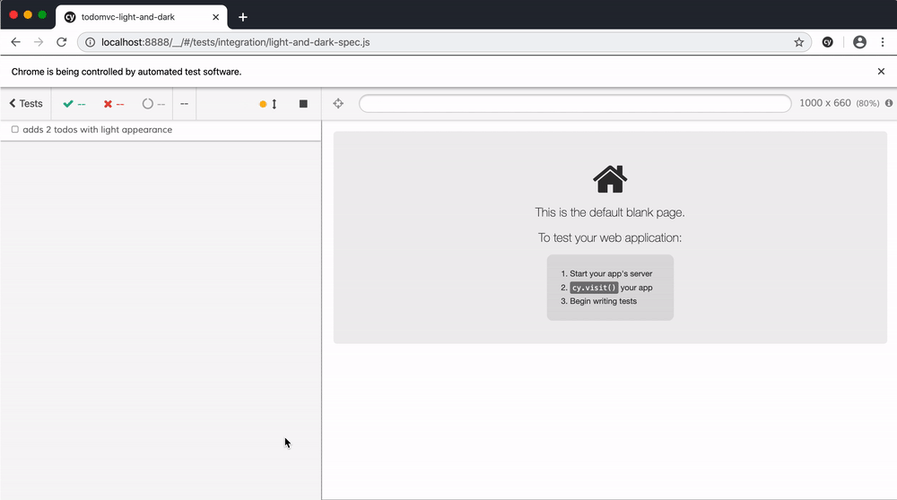

# todomvc-light-and-dark
> TodoMVC with light and dark color theme depending on the OS media preference

Copied from [cypress-example-todomvc](https://github.com/cypress-io/cypress-example-todomvc)

See [cypress/integration](cypress/integration) tests that work against [index.html](index.html)



## Run

```shell
npm install
npm run dev
```

Then click on any spec file

## Related

- [Fix low contrast with Cypress](https://glebbahmutov.com/blog/fix-low-contrast-with-cypress/)
